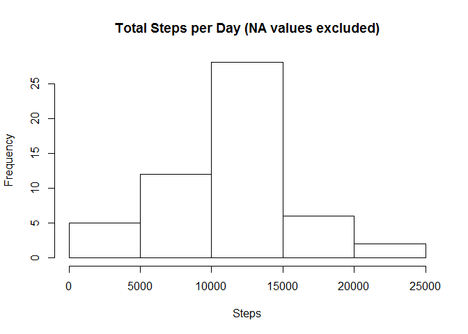
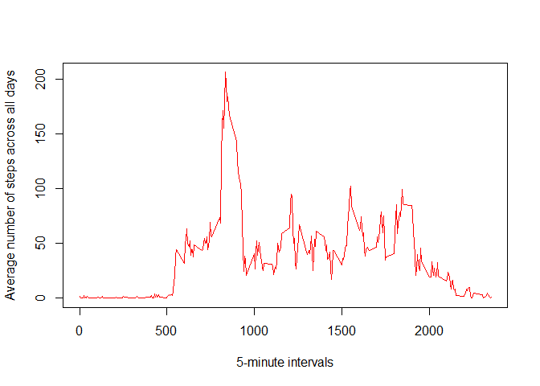
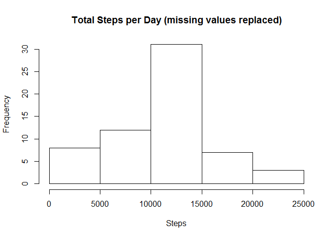

# Reproducible Research: Peer Assessment 1

## Loading and preprocessing the data
Load the activity data into the data frame variable (act). And correct the date format

```r
setwd("F:/DataScience/coursera/05_ReproducibleResearch/week2")
act <- read.csv("activity.csv")
act$date<- as.Date(act$date, format="%Y-%m-%d")
```
## What is mean total number of steps taken per day?
For this part of the assignment, we'll ignore the missing values in the dataset.
act1 : The subset of the activity data without missing steps values

```r
act1 <- subset(act, !is.na(steps))
```
calculate the sum steps by day, create  histogram of the daily total number of steps taken

```r
TotalStepsPerDay <- aggregate(act1$steps, by=list(date=act1$date), FUN=sum, na.rm = TRUE)
names(TotalStepsPerDay) <- c("date", "steps")
hist(TotalStepsPerDay$steps, breaks=5, xlab="Steps", main = "Total Steps per Day (NA values excluded)")
```

<!-- -->

The mean and median total number of steps taken per day

```r
mean(TotalStepsPerDay$steps, na.rm = TRUE)
```

```
## [1] 10766.19
```

```r
median(TotalStepsPerDay$steps, na.rm = TRUE)
```

```
## [1] 10765
```

## What is the average daily activity pattern?
Calculate average steps for each interval for all days.

```r
AverageStepsPerInt <- aggregate(act1$steps, by=list(interval=act1$interval), FUN=mean, na.rm = TRUE)
names(AverageStepsPerInt) <- c("interval", "steps")
```
Plot the Average Number Steps per Day by Interval.


```r
with(AverageStepsPerInt,plot(interval,steps,type="l",xlab="5-minute intervals", ylab="Average number of steps across all days", col="red"))
```

<!-- -->


Interval with most average steps. 

```r
AverageStepsPerInt$interval[which.max(AverageStepsPerInt$steps)]
```

```
## [1] 835
```
## Imputing missing values
the total number of missing values in the dataset 

```r
sum(is.na(act$steps))
```

```
## [1] 2304
```
Impute missing values strategy : Missing values will be imputed by inserting the average for each interval.


```r
act_NA <- act[is.na(act$step),]
act_merge <- merge(act_NA, AverageStepsPerInt, by=c("interval"))
act_merge1 <- act_merge[,c("steps.y","date","interval")]
names(act_merge1) <- names(act)
```
New dataset that is equal to the original dataset but with the missing data filled in :act2

```r
act2 <- rbind(act1, act_merge1)
```
calculate the sum steps by day, create  histogram of the daily total number of steps taken


```r
TotalStepsPerDay2 <- aggregate(act2$steps, by=list(date=act$date), FUN=sum, na.rm = TRUE)
names(TotalStepsPerDay2) <- c("date", "steps")
hist(TotalStepsPerDay2$steps, breaks=5, xlab="Steps", main = "Total Steps per Day (missing values replaced)")
```

<!-- -->


The mean and median total number of steps taken per day


```r
mean(TotalStepsPerDay2$steps, na.rm = TRUE)
```

```
## [1] 10766.19
```

```r
median(TotalStepsPerDay2$steps, na.rm = TRUE)
```

```
## [1] 11015
```


What is the impact of imputing missing data on the estimates of the total daily number of steps?

Using this strategy : replacing missing data with the average number of steps in the same interval slightly changes the mean and the median, the overall shape of the distribution has not changed. 


## Are there differences in activity patterns between weekdays and weekends?
Create a new factor variable day_type in the dataset with two levels - "weekday" and "weekend" indicating whether a given date is a weekday or weekend day. 

```r
act2$daytype <- ifelse(weekdays(act2$date)=="Saturday" | weekdays(act2$date)=="Sunday", "Weekend", "Weekday")
```
Calculate average steps for each interval across all weekday days or weekend days.


```r
AverageStepsPerInt2 <- aggregate(act2$steps, by=list(act2$daytype, act2$interval), FUN=mean, na.rm = TRUE)
names(AverageStepsPerInt2) <- c("daytype", "interval","steps")
```
Make a panel plot containing a time series plot (i.e. type = "l") of the 5-minute interval (x-axis) and the average number of steps taken, averaged across all weekday days or weekend days (y-axis).


```r
library(lattice)

xyplot(steps ~ interval | daytype,
         layout = c(1, 2),
         xlab="Interval",
         ylab="Number of steps",
         type="l",
         lty=1,
         data=AverageStepsPerInt2)
```

<!-- -->


Step's activity starts the morning earlier during the weekdays, then during the rest of the day it's more important during the weekend
